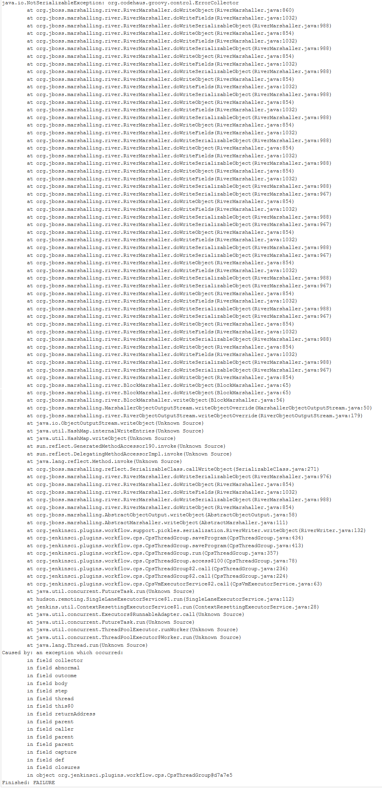

Helpfullness of Jenkins error messages
######################################

:date: 2017-06-19
:tags: jenkins
:category: Programming
:authors: Tobias Pleyer
:summary: Jenkins error output is not easy to interpret

Error messages in Jenkins
=========================

Error messages thrown by Jenkins when an exception happens are absolutely unintuitive! As an example: What is the following output trying to tell us? The solution can be found after the picture...

This concrete output was spit on me a couple of weeks ago. The short version of it could have been written:

    *You are missing a double quotation mark.*

The output from the picture however is far from obvious. I actually found the error by performing a *git diff*. I am not sure why it is a *NotSerializable* error and not a compile error. I can only guess that it comes from the fact that the compile error is actually hidden underneath the serialization error while Jenkins tried to transform the code into `Groovy-CPS`_ form.

.. _Groovy-CPS: https://github.com/cloudbees/groovy-cps
