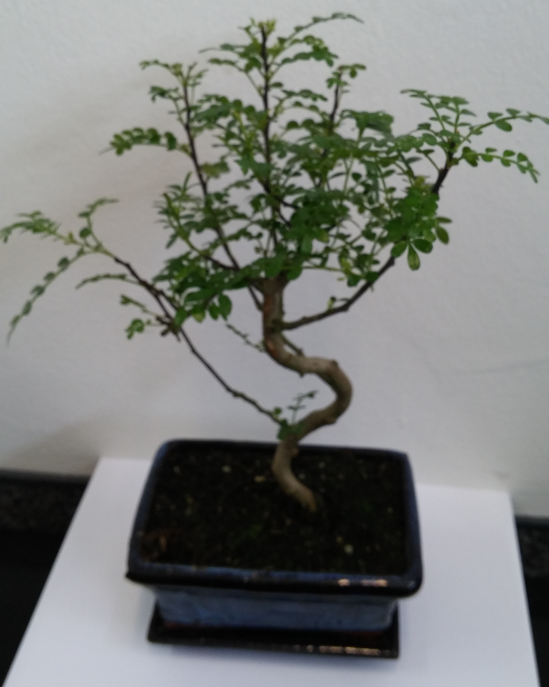
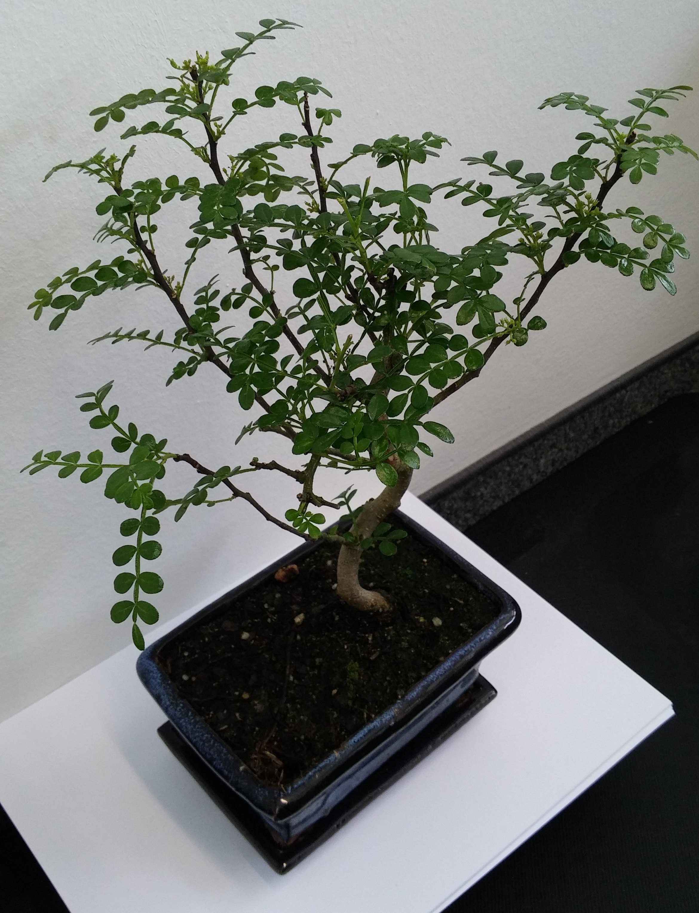
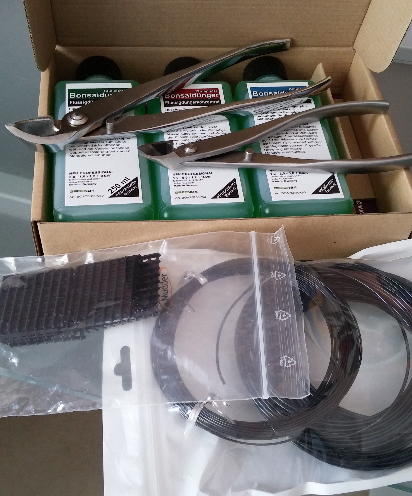
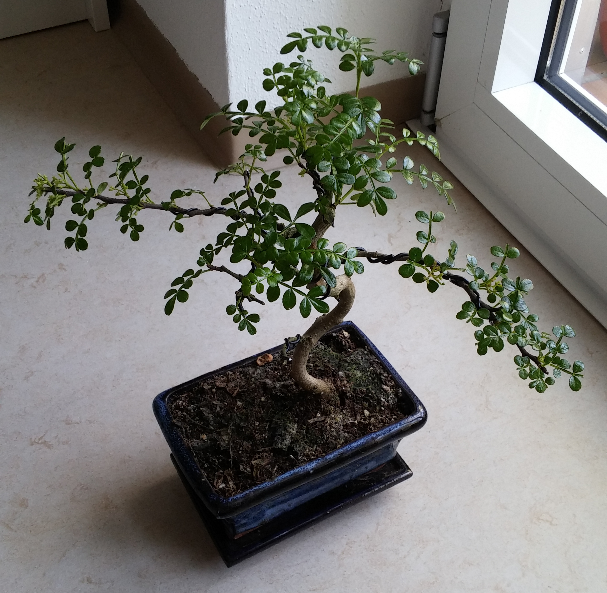
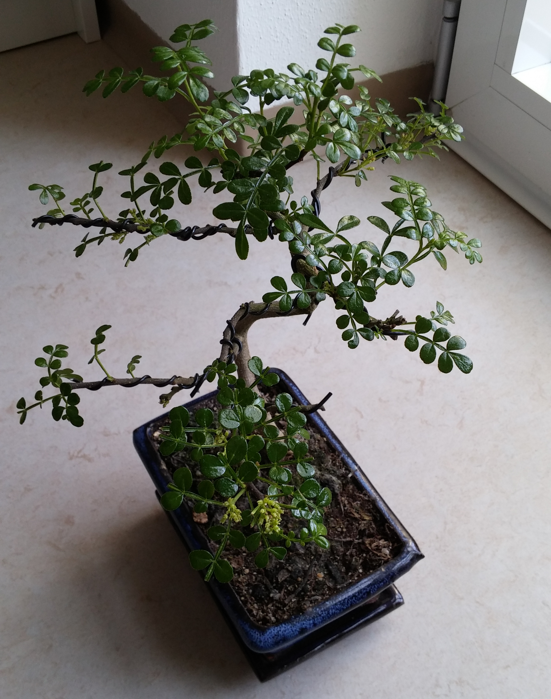
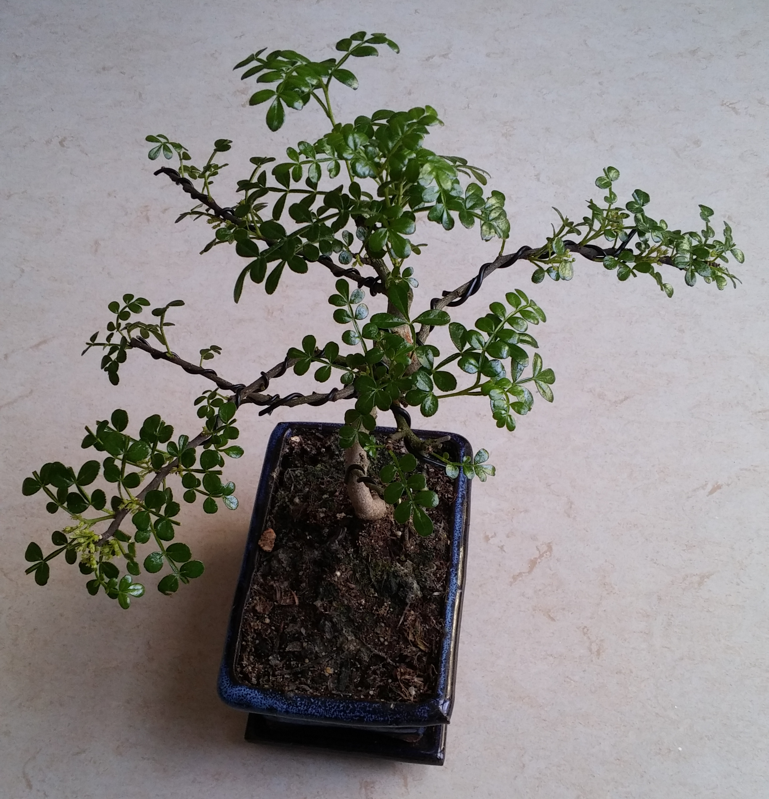
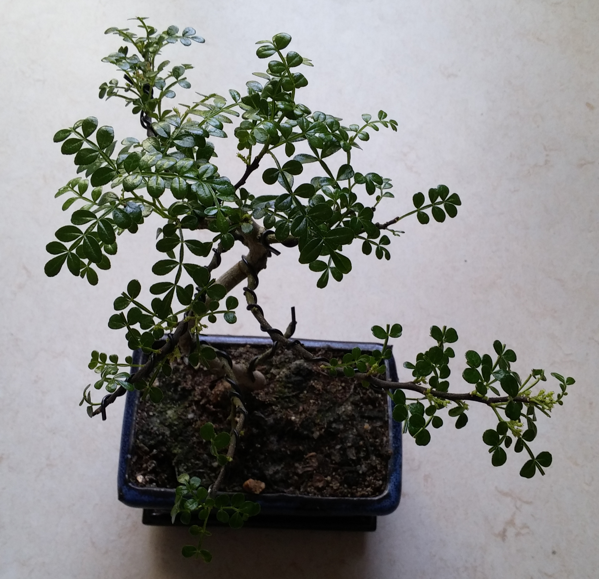

I bought myself a Bonsai
########################

:date: 2018-03-25
:tags: bonsai
:category: Bonsai
:authors: Tobias Pleyer
:summary: The first post about my new bonsai and my way to learn this form of art

I was always fascinated by the art of bonsai. When I was still a kid I convinced
my parents to buy me one. I died within the first year.

After that I didn't buy any trees anymore for many years, until this year, when
I was tempted to buy one again. I was looking so cute and I decided to take it.

The plant is a little Szechuan pepper from China, approx. 3 years old.

The Beginning
=============

These are the pictures of the plant as I bought it.

I invested in a couple of tools, not much just enough to do the wiring and
ferilize the tree. Here are the tools I bought

The tools are:

    * 2 concave pliers
    * 3 different strengths of bonsai wire
    * Bonsai liquid fertilizer
    * Drainage screens for re-potting

After the first wiring
======================

After cleaning the foliage and my first attempt of wiring the tree looked like
that

