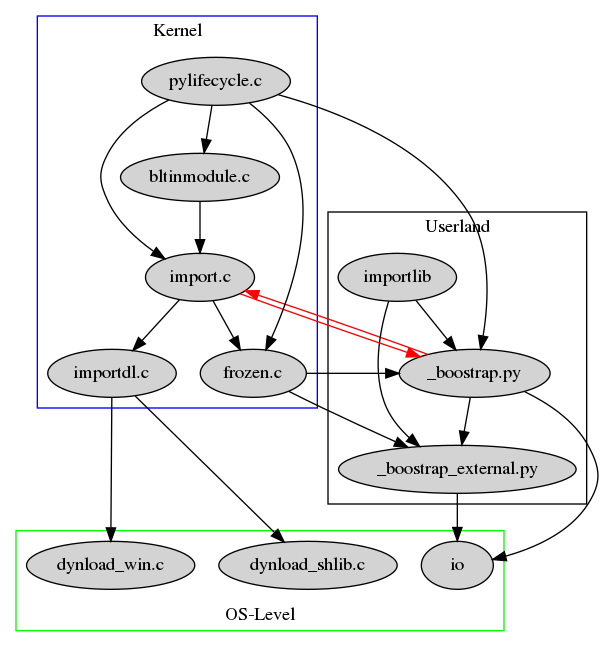

A closer look at Python's import mechanism - Part 3
###################################################

:date: 2017-04-16
:tags: python, import
:category: Programming
:authors: Tobias Pleyer
:summary: Part 3 of "A closer look at Python's import mechanism"

Outline of the Series
=====================

#. `What is a module? <{filename}/post4.rst>`_
#. `The low level import interface <{filename}/post7.rst>`_
#. `Bootstrapping and the importlib module <{filename}/post8.rst>`_
#. How to customize Python's import behaviour

Bootstrapping and the importlib module
--------------------------------------

This is the third part in a series of articles about Python's import mechanism. I am planning to give a detailed look on the entire call stack, from the very low level interface to the very high level interface and its manipulation facilities. You can start at the beginning `here <{filename}/post4.rst>`_.

**Remark:** All my findings, references and source code depictions are based on the
`CPython GitHub repository`_ checked out at tag *v3.6.1rc1*.

.. _CPython GitHub repository: https://github.com/python/cpython

Quick Recall
............

In part 1 of the series we had a quick look at what a module is in the Python language. Part 2 followed with some words about the purpose of *import.c*. In this part we will have a look at the interesting hybrid nature of Python's import mechanism. What makes the implementation so interesting is that it is implemented in C and in Python. The C implementation is calling into Python code, but how did the Python code become available when we are just about to implement the import library? Python is using a simplified import to make the real import available. This kind of mechanism is usually refered to as `bootstrapping`_ and I want to shine some light on it in this article.

.. _bootstrapping: https://en.wikipedia.org/wiki/Bootstrapping

What is an import?
..................

An import is the act of bringing new symbols (variables, functions, ...) into the namespace.

.. code-block:: python

    >>> pprint("1+1=2")
    Traceback (most recent call last):
      File "<stdin>", line 1, in <module>
    NameError: name 'pprint' is not defined
    >>> from pprint import pprint
    >>> pprint("1+1=2")
    '1+1=2'
    >>> 

As the short example above shows, it is not enough to simply use a function, the function needs to be known to the Python interpreter. This is achieved by importing it, after which it is available in the current namespace. This means the interpreter has a way to jump to the machine code when encountering a reference to it. The tasks of an importer are

#. Finding the relevant files on the file system
#. Knowing how to interpret/handle these files
#. Calling the right means to make them available in Python

The first point involves managing a search path and search mechanism. An example for the second point is the question if we are dealing with compiled C code or pure Python code. The third point, among others, involves calling the parser and compiler on the file. The converse argument then reads: As long as we don't have a fully functional importer we have to sacrifice part of the above mentioned benefits of an importer.

The bootstrap contact point
...........................

The above image shows a graph of the involved parts in Python's import mechanism and how they depend on each other (an arrow means "calls into"). The arrows in red show the most critical correlation. To further make my point I will give a concrete example. In `part 2 <{filename}/post7.rst>`_ I showed that the call chain of the import statement will eventually end up in **PyImport_ImportModuleLevelObject**, which is defined in *import.c*. Below is the full definition of this function.

.. code-block:: c
    :linenos: inline
    :linenostart: 1487

    PyObject *
    PyImport_ImportModuleLevelObject(PyObject *name, PyObject *globals,
                                     PyObject *locals, PyObject *fromlist,
                                     int level)
    {
        _Py_IDENTIFIER(_find_and_load);
        _Py_IDENTIFIER(_handle_fromlist);
        PyObject *abs_name = NULL;
        PyObject *final_mod = NULL;
        PyObject *mod = NULL;
        PyObject *package = NULL;
        PyInterpreterState *interp = PyThreadState_GET()->interp;
        int has_from;

        if (name == NULL) {
            PyErr_SetString(PyExc_ValueError, "Empty module name");
            goto error;
        }

        /* The below code is importlib.__import__() & _gcd_import(), ported to C
           for added performance. */

        if (!PyUnicode_Check(name)) {
            PyErr_SetString(PyExc_TypeError, "module name must be a string");
            goto error;
        }
        if (PyUnicode_READY(name) < 0) {
            goto error;
        }
        if (level < 0) {
            PyErr_SetString(PyExc_ValueError, "level must be >= 0");
            goto error;
        }

        if (level > 0) {
            abs_name = resolve_name(name, globals, level);
            if (abs_name == NULL)
                goto error;
        }
        else {  /* level == 0 */
            if (PyUnicode_GET_LENGTH(name) == 0) {
                PyErr_SetString(PyExc_ValueError, "Empty module name");
                goto error;
            }
            abs_name = name;
            Py_INCREF(abs_name);
        }

        mod = PyDict_GetItem(interp->modules, abs_name);
        if (mod == Py_None) {
            PyObject *msg = PyUnicode_FromFormat("import of %R halted; "
                                                 "None in sys.modules", abs_name);
            if (msg != NULL) {
                PyErr_SetImportErrorSubclass(PyExc_ModuleNotFoundError, msg,
                        abs_name, NULL);
                Py_DECREF(msg);
            }
            mod = NULL;
            goto error;
        }
        else if (mod != NULL) {
            _Py_IDENTIFIER(__spec__);
            _Py_IDENTIFIER(_initializing);
            _Py_IDENTIFIER(_lock_unlock_module);
            PyObject *value = NULL;
            PyObject *spec;
            int initializing = 0;

            Py_INCREF(mod);
            /* Optimization: only call _bootstrap._lock_unlock_module() if
               __spec__._initializing is true.
               NOTE: because of this, initializing must be set *before*
               stuffing the new module in sys.modules.
             */
            spec = _PyObject_GetAttrId(mod, &PyId___spec__);
            if (spec != NULL) {
                value = _PyObject_GetAttrId(spec, &PyId__initializing);
                Py_DECREF(spec);
            }
            if (value == NULL)
                PyErr_Clear();
            else {
                initializing = PyObject_IsTrue(value);
                Py_DECREF(value);
                if (initializing == -1)
                    PyErr_Clear();
                if (initializing > 0) {
    #ifdef WITH_THREAD
                    _PyImport_AcquireLock();
    #endif
                    /* _bootstrap._lock_unlock_module() releases the import lock */
                    value = _PyObject_CallMethodIdObjArgs(interp->importlib,
                                                    &PyId__lock_unlock_module, abs_name,
                                                    NULL);
                    if (value == NULL)
                        goto error;
                    Py_DECREF(value);
                }
            }
        }
        else {
    #ifdef WITH_THREAD
            _PyImport_AcquireLock();
    #endif
            /* _bootstrap._find_and_load() releases the import lock */
            mod = _PyObject_CallMethodIdObjArgs(interp->importlib,
                                                &PyId__find_and_load, abs_name,
                                                interp->import_func, NULL);
            if (mod == NULL) {
                goto error;
            }
        }

        has_from = 0;
        if (fromlist != NULL && fromlist != Py_None) {
            has_from = PyObject_IsTrue(fromlist);
            if (has_from < 0)
                goto error;
        }
        if (!has_from) {
            Py_ssize_t len = PyUnicode_GET_LENGTH(name);
            if (level == 0 || len > 0) {
                Py_ssize_t dot;

                dot = PyUnicode_FindChar(name, '.', 0, len, 1);
                if (dot == -2) {
                    goto error;
                }

                if (dot == -1) {
                    /* No dot in module name, simple exit */
                    final_mod = mod;
                    Py_INCREF(mod);
                    goto error;
                }

                if (level == 0) {
                    PyObject *front = PyUnicode_Substring(name, 0, dot);
                    if (front == NULL) {
                        goto error;
                    }

                    final_mod = PyImport_ImportModuleLevelObject(front, NULL, NULL, NULL, 0);
                    Py_DECREF(front);
                }
                else {
                    Py_ssize_t cut_off = len - dot;
                    Py_ssize_t abs_name_len = PyUnicode_GET_LENGTH(abs_name);
                    PyObject *to_return = PyUnicode_Substring(abs_name, 0,
                                                            abs_name_len - cut_off);
                    if (to_return == NULL) {
                        goto error;
                    }

                    final_mod = PyDict_GetItem(interp->modules, to_return);
                    Py_DECREF(to_return);
                    if (final_mod == NULL) {
                        PyErr_Format(PyExc_KeyError,
                                     "%R not in sys.modules as expected",
                                     to_return);
                        goto error;
                    }
                    Py_INCREF(final_mod);
                }
            }
            else {
                final_mod = mod;
                Py_INCREF(mod);
            }
        }
        else {
            final_mod = _PyObject_CallMethodIdObjArgs(interp->importlib,
                                                      &PyId__handle_fromlist, mod,
                                                      fromlist, interp->import_func,
                                                      NULL);
        }

      error:
        Py_XDECREF(abs_name);
        Py_XDECREF(mod);
        Py_XDECREF(package);
        if (final_mod == NULL)
            remove_importlib_frames();
        return final_mod;
    }

The function call in line 1592 is very interesting. The code performs a call to the function **_find_and_load**, which is part of the importlib of the current interpreter. Huh? We are in *import.c* and make a call to importlib? Aren't we in the importlib? Well yes and no. What this call refers to as "importlib" are the files **_bootstrap.py** and **_bootstrap_external.py** (if we have an unmodified Python). That call is one direction of the red arrows in above graph. **_bootstrap.py** and **_bootstrap_external.py** are the central files for import's implementation in pure Python. Apart from a few more helper files they comprise all functions that make import available. The function **_find_and_load** is defined in **_bootstrap.py** which can be found under *CPython/Lib/importlib_bootstrap.py*.

.. code-block:: python
    :linenos: inline
    :linenostart: 958

    def _find_and_load(name, import_):
        """Find and load the module, and release the import lock."""
        with _ModuleLockManager(name):
            return _find_and_load_unlocked(name, import_)

Where it all begins
...................

Now the question arises: Where is importlib defined then? The answer: In the function *import_init* in *pylifecycle.c*

.. code-block:: c
    :linenos: inline
    :linenostart: 247

    static void
    import_init(PyInterpreterState *interp, PyObject *sysmod)
    {
        PyObject *importlib;
        PyObject *impmod;
        PyObject *sys_modules;
        PyObject *value;

        /* Import _importlib through its frozen version, _frozen_importlib. */
        if (PyImport_ImportFrozenModule("_frozen_importlib") <= 0) {
            Py_FatalError("Py_Initialize: can't import _frozen_importlib");
        }
        else if (Py_VerboseFlag) {
            PySys_FormatStderr("import _frozen_importlib # frozen\n");
        }
        importlib = PyImport_AddModule("_frozen_importlib");
        if (importlib == NULL) {
            Py_FatalError("Py_Initialize: couldn't get _frozen_importlib from "
                          "sys.modules");
        }
        interp->importlib = importlib;
        Py_INCREF(interp->importlib);

        interp->import_func = PyDict_GetItemString(interp->builtins, "__import__");
        if (interp->import_func == NULL)
            Py_FatalError("Py_Initialize: __import__ not found");
        Py_INCREF(interp->import_func);

        /* Import the _imp module */
        impmod = PyInit_imp();
        if (impmod == NULL) {
            Py_FatalError("Py_Initialize: can't import _imp");
        }
        else if (Py_VerboseFlag) {
            PySys_FormatStderr("import _imp # builtin\n");
        }
        sys_modules = PyImport_GetModuleDict();
        if (Py_VerboseFlag) {
            PySys_FormatStderr("import sys # builtin\n");
        }
        if (PyDict_SetItemString(sys_modules, "_imp", impmod) < 0) {
            Py_FatalError("Py_Initialize: can't save _imp to sys.modules");
        }

        /* Install importlib as the implementation of import */
        value = PyObject_CallMethod(importlib, "_install", "OO", sysmod, impmod);
        if (value == NULL) {
            PyErr_Print();
            Py_FatalError("Py_Initialize: importlib install failed");
        }
        Py_DECREF(value);
        Py_DECREF(impmod);

        _PyImportZip_Init();
    }

Line 267 is the step where the importlib of the current interpreter is set. A few lines above we can see that importlib actually is the content of **_frozen_importlib**. And what is *_frozen_importlib*? It is a frozen module of importlib. A frozen version of a Python module is its compiled form, its byte code. It is called frozen because once compiled it can't be changed any longer. Any changes to the code have to be recompiled. The compilation serves as a screen shot of the current state of the code. That "frozen code" is compiled into Python and loaded by the function *PyImport_ImportFrozenModule* defined in *import.c*. This more or less concludes the circle. The only thing left to show is that it's really the code of *_bootstrap.py* that is used for compilation. Python's Makefile shows us that this is indeed true

.. code-block:: make
    :linenos: inline
    :linenostart: 730

    # more above...
    ############################################################################
    # Importlib

    Programs/_freeze_importlib.o: Programs/_freeze_importlib.c Makefile

    Programs/_freeze_importlib: Programs/_freeze_importlib.o $(LIBRARY_OBJS_OMIT_FROZEN)
	    $(LINKCC) $(PY_LDFLAGS) -o $@ Programs/_freeze_importlib.o $(LIBRARY_OBJS_OMIT_FROZEN) $(LIBS) $(MODLIBS) $(SYSLIBS) $(LDLAST)

    Python/importlib_external.h:  $(srcdir)/Lib/importlib/_bootstrap_external.py Programs/_freeze_importlib Python/marshal.c
	    ./Programs/_freeze_importlib \
	        $(srcdir)/Lib/importlib/_bootstrap_external.py Python/importlib_external.h

    Python/importlib.h:  $(srcdir)/Lib/importlib/_bootstrap.py Programs/_freeze_importlib Python/marshal.c
	    ./Programs/_freeze_importlib \
	        $(srcdir)/Lib/importlib/_bootstrap.py Python/importlib.h

    ############################################################################
    # more below...

_bootstrap.py
.............

As I have mentioned above, *_boostrap.py* is the file that holds most of the Python side implementation of import. Importing a module or package in Python means making it available in the modules dictionary of the builtin *sys* module. This means *_boostrap.py* has to do manipulations of *sys.modules*. As a pure Python file the possibilities available are very limited without additional imports, especially accessing the *sys* module! Looking into the file, we see not a single import statment. We can't write

.. code-block:: python

    import sys

because at this point the import statement is not available yet! We, the module, are the import statement! That is the revolving point of the boostrap process. Instead *_boostrap.py* has to be "installed". The *_install* function is defined within *_bootstrap.py*. Here is the source code

.. code-block:: python
    :linenos: inline
    :linenostart: 1136

    def _install(sys_module, _imp_module):
        """Install importlib as the implementation of import."""
        _setup(sys_module, _imp_module)

        sys.meta_path.append(BuiltinImporter)
        sys.meta_path.append(FrozenImporter)

        global _bootstrap_external
        import _frozen_importlib_external
        _bootstrap_external = _frozen_importlib_external
        _frozen_importlib_external._install(sys.modules[__name__])

As is visible in the code segement above, we explicitly hand over the *sys* and the *_imp* module. These modules are enough to implement import. The *_install* function does the following

#. Set itself up, by calling its private setup function
#. Adding importers to sys.meta_path (more on this in Part 4). At this point we can already import builtin and frozen modules.
#. Now we can actually already use the import statement to import _frozen_importlib_external (external means outside of the Python source tree, i.e. neither frozen nor builtin)
#. _frozen_importlib_external is installed. At this point we are able to import arbitrary modules from the file system and import is fully functional.

At this point we are done. Import is available and fully functional. All the low level code will call into the above mentioned Python files. Importing importlib within a Python file will make these functions accessible for custom use.

Summary
-------

The choice of Python's core developer team to make most of its import mechanism available as Python code is a nice thing in my opinion. It gives maximum transparency to the language and allows for easy manipulation directly in pure Python code. Part of this will be seen in the fourth part of this series.
At the first instance it was not so easy to wrap my head around the ongoings of the boostrapping process. Basically Python compiles its pure Python import library into byte code which is statically linked into the Python executable. From there this code is loaded and made "the importlib of the interpreter". If we import the pure Python importlib module, this "importlib of the interpreter" is used to install *_bootstrap.py* and *_bootstrap_external.py* as the implementation of *import*, in the course of which these are compiled again with possibly different source code.
